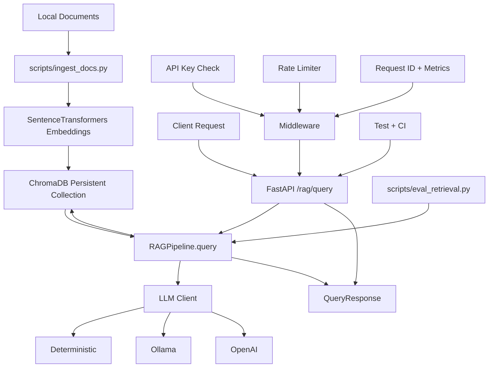

# Sword Architecture

## Overview

Sword is organized as a learning-to-production AI system with five connected layers:

1. Learning scripts for deep learning and transformer workflows.
2. Ingestion and embedding pipeline for retrieval corpus construction.
3. Retrieval and generation pipeline (RAG core).
4. API service layer with auth, throttling, and observability.
5. Validation layer with tests, evaluation scripts, and CI.

## Component Map

## Request Flow

1. Client sends `/rag/query` with `question` and optional `top_k`.
2. API middleware assigns request ID and starts timing.
3. Security dependencies enforce API key and rate limit policy.
4. `RAGPipeline` embeds the question and queries ChromaDB for nearest contexts.
5. Generation provider synthesizes a grounded answer from retrieved contexts.
6. API returns answer, contexts, and generation provider metadata.
7. Metrics store records status, route, and latency.

## Ingestion Flow

1. `scripts/ingest_docs.py` collects files by glob pattern.
2. Documents are optionally chunked by `chunk_size` and `chunk_overlap`.
3. Each chunk is embedded and stored with metadata (source path and chunk index).
4. ChromaDB persists vectors and documents for future retrieval.

## Design Choices

- Provider abstraction allows deterministic, local, and hosted generation backends.
- Persistent vector store keeps retrieval state between runs.
- API-level controls make the system production-oriented, not notebook-only.
- Evaluation scripts and tests provide measurable quality and regression protection.
- Labeled grounding probes in `scripts/eval_retrieval.py` turn retrieval checks into answer-fragment recall gates.

## Operational Interfaces

- Health: `GET /health`
- Metrics: `GET /metrics`
- Ingest: `POST /rag/ingest`
- Query: `POST /rag/query`

## Extensibility Points

- Swap embedding model via `EMBEDDING_MODEL`.
- Add generation backends through `llm_clients.py` provider pattern.
- Expand retrieval metrics in `scripts/eval_retrieval.py`.
- Add domain datasets and adapters in the scripts layer.

## Deployment Reference

See `docs/deployment-topologies.md` for local, staging, and production deployment patterns.
